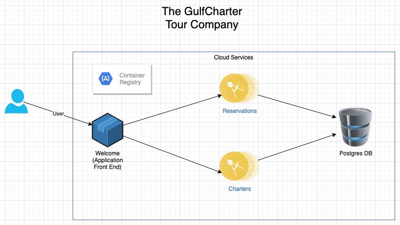

# Multiple Target Environments - Advanced

## Overview
Unlike the other examples, this document is an advanced tutorial. The goal is to describe a microservices-based application, and target it for
three (or more) environments:

 - Development - When running the workload locally, use `docker-compose` to minimize the amount of complexity associated with a Kubernetes environment
 - Staging - Target a modest Kubernetes workload to ensure that all of the components work well together. We'll use `minikube` in the instructions. However,
   it's also possible to deploy the resource files to another Kubernetes installation.
 - Production - Leverage a production registry (IBM Container Registry) and a production cluster (Red Hat OpenShift)

Normally, a multi-targeted workload requires several unique configuration files, and tooling (such as `Kustomize`) to work correctly. This tutorial
hopes to demonstrate that developer configuration files remain constant - even when completely different contaner workload managers are used.

Due to the complexity, it's recommended that you review the other examples before proceeding to this example.

## The Application

Usually, tutorials work best with an actual business problem. For the following work, we'll be building a boat charter application.
The purpose of the application is to allow a boat captain to advertise a number of charters and take reservations for those charters.

The following diagram illustrates the various components within the system:

### Diagram - GulfCharter Touring Company



### Components:
1. `welcome` - The main landing page. This component acts as the main interface between the users and the various microservices and other
   system resources.
2. `charters` - A microservice which manages the list of available charters.
3. `reservations` - A microservice which manages customer reservations for a particular charter
4. A container registry
5. Two databases - one for the charters microservice, and one for the reservations microservice.
6. Secrets - sensitive information which contains credentials for accessing the database(s)

**Note #1:** The code samples used in this tutorial are _not_ fully implemented. Rather, each provides a skeleton amount of functionality,
which serves the needs of the tutorial. For example, the `welcome` component doesn't actually contain a user interface. Instead, there are
two JSON-style endpoints which can simulate the experience of calling an endpoint (which, in turn, calls a microservice). Implementing the full suite
of application code functionality is left as an exercise for the reader.

**Note #2:** These instructions assume that you're using a Mac computer. Most steps should be nearly identical for Linux, and somewhat close
for Windows.

### Repositories

It's considered a best practice to implement each microservice as a separate git repository. It's also a best practice to create a git repository
to manage the CI/CD pipeline configuration files. (This is commonly referred to as "Git Ops".)

The following git repositories will be used during the tutorial. It is recommended that you fork each repository, so that you
can make changes and see how the repositories change as the code makes it's way through the system.

Welcome:

`https://github.com/tcrowleyibm/welcome.git`


Charters:

`https://github.com/tcrowleyibm/charters.git`


Reservations:

`https://github.com/tcrowleyibm/reservations.git`


Deployment details for staging and performance environments:

`https://github.com/tcrowleyibm/gulfcharter_stage_perf.git`


Deployment details for production:

`https://github.com/tcrowleyibm/gulfcharter_prod.git`


## Getting Started

To get started, it's necessary to ensure that `rezolvr` is installed and clone the repositories. You can determine if `rezolvr` is 
installed by typing `rezolvr` in a terminal. If it's not installed, then please refer to the main repository to install it:
https://github.com/IBM/rezolvr

Sample commands to clone the repository:
```
mkdir src
cd src
git clone https://github.com/tcrowleyibm/welcome.git
git clone https://github.com/tcrowleyibm/charters.git
git clone https://github.com/tcrowleyibm/reservations.git
git clone https://github.com/tcrowleyibm/gulfcharter_stage_perf.git
git clone https://github.com/tcrowleyibm/gulfcharter_prod.git
```


### Registry Details

As with some of the other samples, this tutorial uses an "insecure" (non-HTTPS) registry for development. This should NOT
be used in production; it's for educational purposes only.

Prior samples provide the details for setting up an insecure registry, but the basic steps:

1. Set up a DNS entry which can be resolved locally (via the `hosts` file).
   It can be any value, but `host.minikube.internal` can provide some compatability
   with Kubernetes-related work.

   The `hosts` file entry should resolve to the localhost IP address.

2. Start up an HTTP-based instance of a Container registry:

   `docker run -d -p 5000:5000 --restart=always --name registry registry:2`


### Jeninks

For CI/CD activities, this tutorial uses Jenkins (https://www.jenkins.io/). The steps for setting up a container-based version
of Jenkins can be found in the `pipeline` example directory. This tutorial assumes that a fully working - and docker-enabled -
instance of Jenkins is up and running. It also assumes that Jenkins can communicate with the insecure registry.

Once Jenkins is up and running, it's necessary to create pipelines for each of the components (welcome, charters,
reservations, and the deployment projects). The basic steps are:

1. Log into Jenkins and access the Dashboard
2. Click `New Item`
3. Enter a name (example: `charters` for the charters microservice)
4. Select "Pipeline", and click OK
5. In the new form, specify a description for the pipeline
6. Click the "Pipeline" tab, and select "Pipeline script from SCM" from the "Definition" dropdown
7. Specify "git" as the SCM.
8. Enter the repository URL, and credentials for accessing the repo. (You'll need a personal access token - see the
   Jenkins documentation for additional details.)
9. Change branch specifier from `*/master` to `*/main`. (All of the repositories use the new "main" branch convention.)
10. Click "Save". The pipeline should now be fully created.

**Note:** To review the `Jenkinsfile` specifics, please refer to each repository.

You should now be able to trigger a build of each component within the system.

## Development Environment - Up and Running

### Overview
In this section of the tutorial, we'll review configuration information, and generate `docker-compose` files which
can be used locally. Upon completion of this section, you should have a fully functional deployment of the application.

### Development Configuration Files

For the first target environment - development - we'll use "local" files which exist in this repository. These files are
saved in the rezolvr subdirectory, and are organized as follows:

```
 development
   |
   - deploy
   - rezolvr
       |
       - local
           |
           - credentials.yaml
           - databases.yaml
           - registry.yaml
           - env-compose.yaml
```

Notes:
 - It's a convention to store platform-specific component configuration files 
   in the `local` directory
 - When run, `rezolvr` persists state information in a file named `state.yaml`. It's
   a convention to store this in the `local` directory as well.
 - The generated deployment files are stored in the `deploy` directory.

The `local` files:
- `credentials.yaml` - Information about secrets
- `databases.yaml` - Container-based databases. (Other environments will use managed databases.)
- `registry.yaml` - Information about the insecure (dev) registry
- `env-compose.yaml` - Configuration information that's specific to both `docker-compose` and the local dev environment

One further note: These files are currently stored within this example directory. In practice, they would exist in their
own git repository. However, they're stored here for simplicity.


### Steps

1. If you haven't done it yet, trigger a build of each of the components: welcome, charters, and reservations.
   The builds may not complete fully, but that's simply because we haven't pre-populated the `lib` directory.
   As long as each component is built and pushed to the dev container registry, we're ready for the next step.
2. Open a terminal and navigate to the `./development` directory
3. Execute the following command:
   ```
   rezolvr apply -a ./rezolvr/local/credentials.yaml -a ./rezolvr/local/databases.yaml \
     -a ./rezolvr/local/registry.yaml -a ../welcome/rezolvr/welcome.yaml -a ../charters/rezolvr/charters.yaml \
     -a ../reservations/rezolvr/reservations.yaml \
     -e ./rezolvr/local/env-compose.yaml -s ./rezolvr/local/state.yaml -o ./deploy/ 
   ```
4. After a successful run, a `docker-compose.yaml` file should be created in the `./deploy` directory. Also, a
   state file will be created in the `./local` directory.
5. To start the application, navigate to the `./deploy` directory and run: `docker-compose up`
6. Navigate to http://localhost:3000/message. You should get a response stating "Hello from Rezolvr!"
7. Navigate to http://localhost:3001/charters. You should see a JSON representation of three charters
8. Navigate to http://localhost:3003/reservations. You should see a JSON representation of one reservation
9. Navigate to http://localhost:3000/reservation. You should see the same reservation
10. To shut down the application, run `docker-compose down`. The application and associated containers should be removed.

### Checkpoint

As this point, we've successfully deployed a microservices-based application to a local development environment. This
is a good first step. However, if further deployments require code or configuration changes to the source repositories,
then not much has been gained. In the next section, we'll examine what sort of changes are required to target a staging
environment.


## Staging Environment - Up and Running

### Overview

In this section of the tutorial, we'll review configuration information, and generate a series of Kubernetes files which
can be used with `minikube`. Upon completion of this section, you should have a fully functional, Kubernetes-based
deployment of the application.

**Note:** It probably goes without saying, but it's necessary to verify that `minikube` has been installed and configured.

Besides switching from Compose to Kubernetes, the target architecture is slightly different:
 - The database credentials are now more sensitive, so they should truly be kept secret
 - There's value in creating more than one instance of a microservice
 - Optional: There's value in creating a storage volume, so that the database isn't recreated every time a new build is deployed

A key point: These are desired _operational changes_; they require no changes to the microservices, so the impact to the developers
should be nonexistent. 


### Staging Configuration Files

For the staging environment, we'll use a separate deployment git repository to track changes.
The repository - `gulfcharter_stage_perf` manages deployment details for both the staging and performance environments.
The staging-specific contents are as follows:

```
 staging
   |
   - config
   - deploy
   - rezolvr
       |
       - lib
       - local
           |
           - credentials.yaml
           - databases.yaml
           - registry.yaml
           - environment-staging.yaml
```

Notes:
 - It's a convention to reserve the `lib` directory for component configuration files
 - It's also a convention to store platform-specific component configuration files 
   in the `local` directory
 - When run, `rezolvr` persists state information in a file named `state.yaml`. It's
   a convention to store this in the `local` directory as well.
 - The generated deployment files are stored in the `deploy` directory.

The `local` files:
- `credentials.yaml` - Information about secrets. (Unchanged from before)
- `databases.yaml` - Container-based databases. (Also unchanged.)
- `registry.yaml` - Information about the insecure registry. (Also unchanged.)
- `environment-staging.yaml` - Configuration information that's specific to both `Kubernetes` and the staging environment


### The CI/CD Pipeline

The staging environment builds upon the development environment experience. And since we're now deploying the updates to
a more complex environment, it's recommended that changes be documented, tracked and understood. To do this, a separate
pipeline is used. The purpose of this new pipeline is to combine all of the components of the system and _resolve_ all
of their deployment dependencies. The changes are then stored in git, where tooling - such as Argo CD - can listen for
changes, and deploy the changes to a Kubernetes cluster.

The basic steps in this pipeline:
 - Wait for changes to one of the child components (welcome, charters, reservations). Child component pipelines will
   trigger a build of the new pipeline.
 - Pull the latest version of the staging git repository.
 - Identify the component that changed, and pull the latest version of that repository.
 - Copy configuration files from the child repo into the `lib` directory of the staging repo.
 - Run `rezolvr` to resolve all dependencies and generate updated deployment files.
 - Commit the changes to the staging repository, and push them to the hosted instance of the git repo.
 
 It should be noted that the change in configuration files (via a git commit) can be used to trigger a deployment
 of the changes to the staging environment. (This is left as an exercise for the reader.)

### Steps

1. Create a secret in the `minikube` environment. To do this, create a scratch directory, and run the following commands:
   ```
   echo -n "abetterusername" > username.txt
   echo -n "passwordie" > password.txt
   kubectl create secret generic databasecredentials --from-file=db_username=./username.txt --from-file=db_password=./password.txt
   ```
2. If you haven't created a Jenkins pipeline for the staging environment, create it now. The `Jenkinsfile` can be found
   in the `./staging/config` directory of the `gulfcharter_stage_perf` git repo.
3. Trigger a build of the staging pipeline.
4. Pull the latest code from the `gulfcharter_stage_perf` git repo to your machine.
4. After a successful run, multiple Kubernetes configuration files should be created in the `./staging/deploy` directory.
   Also, a state file will be created in the `./staging/rezolvr/local` directory.
5. Navigate to the `./staging/deploy` directory and manually push the files to the staging environment:
   ```
   kubectl apply -f chartersdb.yaml
   kubectl apply -f chartersms.yaml
   kubectl apply -f reservationsms.yaml
   kubectl apply -f welcomeapp.yaml
   ```
6. As with the development environment, test the endpoints. Since the environment configuration specified that a
   Kubernetes `NodePort` was used for the services, the endpoints can be determined by running the following commands:
   ```
   minikube service --url chartersms-service
   minikube service --url reservationsms-service
   minikube service --url welcomeapp-service
   ```

   After retrieving these endpoints, test the following:
    - Navigate to http://{welcomeapp-service-url}/message. You should get a response stating "Hello from Rezolvr!"
    - Navigate to http://{chartersms-service-url}/charters. You should see a JSON representation of three charters
    - Navigate to http://{reservationsms-service-url}/reservations. You should see a JSON representation of one reservation
    - Navigate to http://{welcomeapp-service-url}/reservation. You should see the same reservation

10. To shut down the application, run the following commands:
    ```
    kubectl delete -f welcomeapp.yaml
    kubectl delete -f chartersms.yaml
    kubectl delete -f reservationsms.yaml
    kubectl delete -f chartersdb.yaml
    ```
    The application and associated containers should be removed.

### Checkpoint

As this point, we've successfully deployed a microservices-based application to both a local development environment
and a minikube environemt. And even though Compose and Minikube are _very_ different, these differences required
absolutely no changes to the microservices code. Perhaps more importantly, none of the configuration files associated
with the microservices changed either. This means that we've created a level of isolation between the needs of the
developer and the needs of the ops professional.


## Production Environment - Up and Running

### Overview
So far, we've made good progress. However, there are a few shortcomings in the prior environments, and we hope to 
address them in production:
 - The databases reside within Kubernetes. A more realistic approach for production would be to leverage a cloud-based
   managed service.
 - The number of availability zones and instances of the microservices must be scaled. A change in scaling should not
   require a change in developer code. It should also not require a change in developer configuration-based code.
 - It's probably obvious that (most) companies don't use `minikube` in production. We'll switch to a more production-
   ready platform - Red Hat OpenShift.
 - The prior examples used an insecure registry. This might work well for development, but it's a security risk in
   most other environments. We'll switch to a more production-ready registry - the IBM Container Registry (ICR).

### Production Configuration Files

For the production environment, we'll use a separate deployment git repository to track changes.
Of course, it's possible to use the same repo as used in staging. However, for security reasons, most organizations
prefer to have a separate repo with separate credentials.

The repository - `gulfcharter_prod` manages deployment details for the production environment.
The contents are as follows:

```
 production
   |
   - config
   - deploy
   - rezolvr
       |
       - lib
       - local
           |
           - credentials.yaml
           - databases.yaml
           - registry.yaml
           - environment-production.yaml
```

Notes:
 - It's a convention to reserve the `lib` directory for component configuration files
 - It's also a convention to store platform-specific component configuration files 
   in the `local` directory
 - When run, `rezolvr` persists state information in a file named `state.yaml`. It's
   a convention to store this in the `local` directory as well.
 - The generated deployment files are stored in the `deploy` directory.

The `local` files:
- `credentials.yaml` - Information about secrets. (Unchanged from before)
- `databases.yaml` - Container-based databases. (Also unchanged.)
- `registry.yaml` - Information about the insecure registry. (Also unchanged.)
- `environment-staging.yaml` - Configuration information that's specific to both `Kubernetes` and the staging environment

**Note:** If not much changes to `local` files between environments, it's possible to store them in a common repo that's
shared amongst the various environments.

### The CI/CD Pipeline

Unlike prior pipelines, most enterprises prefer to manually trigger pushes to production. This tutorial will follow
that convention. However, it's not a convention that's forced by the tooling, it's simply a preference. If your organization
prefers an automated push to production, then it's entirely possible. The instructions would be nearly identical to the
CI/CD pipeline steps for the staging environment.

Production deployments may also prefer to use something other than the latest configuration files in the staging repo.
Instead, they may tag a particular git commit as a candidate, and then perform additional testing - even if additional
builds occur in the staging environment.

Jenkins supports the concept of pulling a particular commit from git. However, for simplicity in this tutorial, we'll
assume that the most recent build is the correct one.

Similar to staging, the purpose of the production pipeline is to combine all of the components of the system and _resolve_ all
of their deployment dependencies. The changes are then stored in git, where tooling - such as Argo CD - can listen for
changes, and deploy the changes to a Kubernetes cluster.

The basic steps in this pipeline:
 - Manually trigger a new build
 - Pull the latest version of the production git repository.
 - Pull the latest version of the staging git repository.
 - Copy configuration files from the staging repo into the `lib` directory of the production repo.
 - Run `rezolvr` to resolve all dependencies and generate updated deployment files.
 - Commit the changes to the production repository, and push them to the hosted instance of the git repo.
 - Alternatively, commit the changes to the production repository _in a separate branch_, and push them to
   the hosted instance of the git repo. From there, it's possible to create a pull request, so that someone can
   approve the request. (This supports a separation of concerns amongst teams.)
 
**Note 1:** The change in configuration files (via a git commit) can be used to trigger a deployment
 of the changes to the production environment. (This is left as an exercise for the reader.)

**Note 2:** The container images should be promoted to the production container registry. There are several valid
ways to do this, so the activity is left as an exercise for the reader.


### Production-grade Services

The following services will be used in our production environment:
 - Registry: IBM Container Registry  https://cloud.ibm.com/kubernetes/catalog/registry
 - Database: Databases for PostgreSQL  https://cloud.ibm.com/catalog/services/databases-for-postgresql
 - Kubernetes: Red Hat OpenShift  https://cloud.ibm.com/kubernetes/catalog/create?platformType=openshift

Configuration of these services is beyond the scope of this tutorial. Please see the links for creation and
configuration information.

### Steps

1. Push the images to the production-grade container registry. This is usually done via automation,
   but for simplicity, it can be done manually. The basic steps:
   - Log in to the private registry with the appropriate credentials (e.g. `ibmcloud cr login`)
   - Tag the image with the private registry details (e.g. `docker tag catalog us.icr.io/my-registry/charters`, etc)
   - Push the images to the private registry (e.g. `docker push us.icr.io/myregistry/charters`)
2. Create a secret in the OpenShift environment. The process is similar to the instructions in the staging section.
3. If you haven't created a Jenkins pipeline for the production environment, create it now. The `Jenkinsfile` can be found
   in the `./production/config` directory of the `gulfcharter_prod` git repo.
4. Trigger a build of the production pipeline.
5. Pull the latest code from the `gulfcharter_prod` git repo to your machine.
6. After a successful run, multiple Kubernetes configuration files should be created in the `./production/deploy` directory.
   Also, a state file will be created in the `./production/rezolvr/local` directory.
7. Ideally, tooling similar to Argo CD should deploy the updated deployment files. However, they can be done manually by
   navigating to the `./production/deploy` directory and manually pushing the files to the production environment:
   - Log into the Red Hat OpenShift cluster (e.g. `oc login --token=<some very long token> --server=<some server>`)
   - Verify a successful connection (e.g. `kubectl get nodes`)
   - Apply the deployment files:
      ```
      kubectl apply -f chartersms.yaml
      kubectl apply -f reservationsms.yaml
      kubectl apply -f welcomeapp.yaml
      ```
   **Note:** There is no longer a deployment file for the database(s).
8. Expose the endpoints by either using an ingress controller, or by creating OpenShift routes.

   After retrieving these endpoints, test the following:
    - Navigate to http://{welcomeapp-service-url}/message. You should get a response stating "Hello from Rezolvr!"
    - Navigate to http://{chartersms-service-url}/charters. You should see a JSON representation of three charters
    - Navigate to http://{reservationsms-service-url}/reservations. You should see a JSON representation of one reservation
    - Navigate to http://{welcomeapp-service-url}/reservation. You should see the same reservation

9. To shut down the application, run the following commands:
    ```
    kubectl delete -f chartersms.yaml
    kubectl delete -f reservationsms.yaml
    kubectl delete -f welcomeapp.yaml
    ```
    The application and associated containers should be removed.


### Checkpoint

As this point, we've successfully deployed a microservices-based application to three different environments.
And, as before, these differences required absolutely no changes to either the microservices code or the
associated configuration files. This means that we've continued to maintain complete isolation between the needs of the
developer and the needs of the ops professional.


## Changes and Errors

So far, this tutorial has focused on getting everything to work. However, it's also valuable to see what happens when
things go wrong. The following are some experiments that you may consider performing:
- Change the welcome BFF to support more detailed orchestration. Verify that no changes are required to the other components
- Change a service to require an extra dependency, such as a message queue. When `rezolvr` can't resolve the
  dependency, it should trigger an error and the build should fail. Create the message queue and associated
  configuration information, and get the build to work.
- Change an optional environment variable to a required variable, and ensure the build fails. Create the new environment
  variable, and get the build to work.

## Conclusion

As stated in the introduction, the goal of this tutorial has been to demonstrate how developer-specific configuration information
can be separated from operational-specific configuration information. Then, when combined, multiple different platforms may be targeted,
with different levels of resiliency and associated cost.

We developed a multi-stage development and deployment process, and targeted significantly different environments. At each point, we were
able to tailor the deployment specifics without involving the development team. Stated another way, we allowed the developers to do what they
do best - write code. At the same time, we allowed the ops teams to focus on what they do best - maintain high quality operational excellence.

Normally, a multi-targeted workload requires several unique configuration files, and complex tooling. This tutorial
demonstrated that developer configuration files remain constant - even when completely different contaner workload managers are used.

Additional insights include:
- This approach helps facilitate the independent development of microservices. As long as dependencies don't change,
  microservices can independently evolve without impacting the rest of the system
- Dependencies are resolved before deployment, and problems can be automatically discovered
- This dependency resolution provides a level of assurance that changes won't break production

Lastly, the example application in this tutorial has a small number of parts. However, the same principles apply to larger and more
complex applications. In fact, as applications scale to dozens of microservices, it's assumed that `rezolvr` will move from being
valuable to critical. Stated another way: Instead of attempting to mentally remember the cross-dependencies between 
dozens of microservices, `rezolvr` allows someone to look at each component in isloation, and then generate deployment details which
are fully resolved. Once fully resolved, the individual can be sure that all of the components' dependencies have been met, and
a deployment can succeed.


